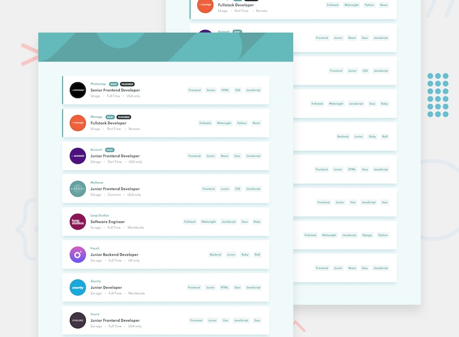

# Job Listings Challenge

Hosted on Vercel

Job Listings Challenge from [Frontend Mentor](https://www.frontendmentor.io/challenges/job-listings-with-filtering-ivstIPCt)

## [Demo](https://job-listings-with-filtering-mu.vercel.app/)



## Features

Users should be able to:

- View the optimal layout for the site depending on their device's screen size
- See hover states for all interactive elements on the page
- Filter job listings based on the categories

## Technology Used

- [React.js](https://reactjs.org/)
- [Material UI](https://material-ui.com/)
- Hosted on [Vercel](https://vercel.com/)

## Development

1. Clone repo

   ```
   git clone https://github.com/abdelmawlaSouat/Job-listings-with-filtering
   ```

2. Install Dependencies

   ```
   cd Job-listings-with-filtering && npm i
   ```

3. Run the dev server

   ```
   npm run start
   ```
